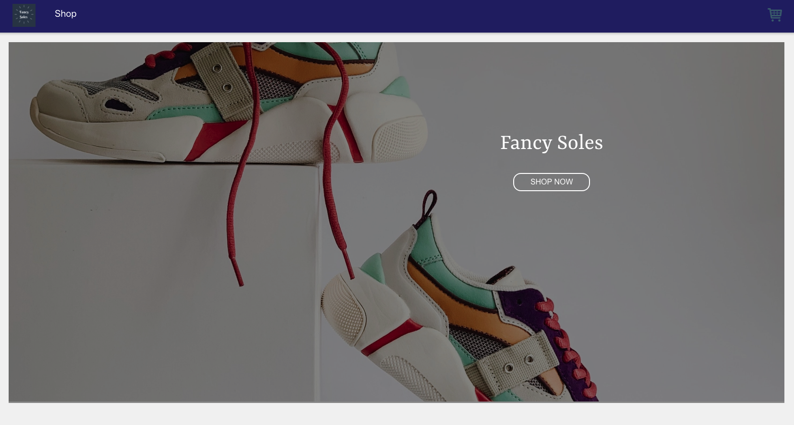
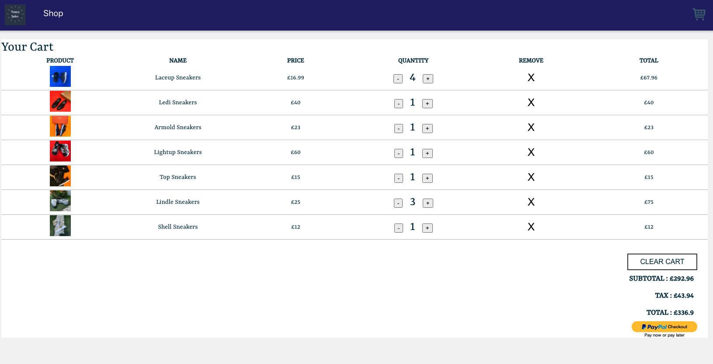

## FancySoles

### About Fancysoles

Fancysoles is an ecommerce store for Fancy Soles retail company.  
The app was built using HTML, CSS and React.

Users can shop for various shoes and sneakers.

Various products can be added to cart with the payment functionality provided by paypal.

 
Checkout the live view of the project on

https://fancysoles.netlify.app/

 

### Getting started?

- Clone the repo and install the dependencies by running `<nmp i>` on the root folder.
- Run the project by running `<nmp start>` from the root folder and access it on your web-browser with the default react port localhost:3000.
